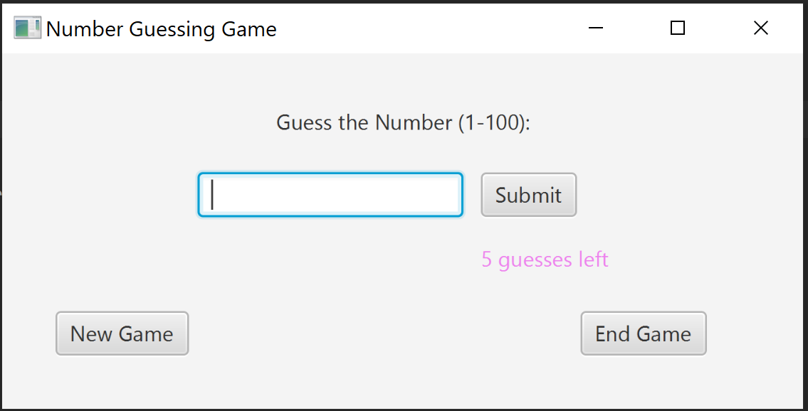

# Number Guessing Game

## Description
Program generates a random number between 1 and 100. The user guesses what number has been chosen. The program prints "Too Low!" or "Too High!" if the users input is lower or higher than the chosen number. The program prints "Correct!!!" if the number is guessed correctly and ends after 5 tries.

## Tools
Uses javaFX features on jdk 8

